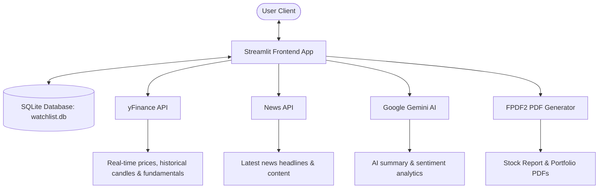

# 🇮🇳 Indian Stock Research Agent — AI-Powered Fintech Terminal

[](https://www.python.org/)
[](https://streamlit.io/)
[](https://www.sqlite.org/)
[](https://ai.google.dev/)
[](https://github.com/py-pdf/fpdf2)

An advanced, Bloomberg-inspired AI financial research assistant and portfolio tracker tailored specifically for the Indian Stock Market (NSE/BSE). This application fetches real-time market data, computes technical indicators, performs news sentiment analysis, manages watchlists and portfolio holdings in a SQLite database, validates inputs, alerts on market closures, and exports clean, publication-quality PDF reports.

---

## 📌 Features

### 1. 📈 Technical Stock Analysis
* **Interactive Candlestick Charts**: Rendered using Plotly, displaying 20-day and 50-day Simple Moving Averages (SMA).
* **Technical Indicators**: Calculates 14-day Relative Strength Index (RSI) with clear status tags (`OVERBOUGHT`, `OVERSOLD`, `NEUTRAL`).
* **Date Flexibility**: Toggle between predefined periods (`1D`, `1W`, `1M`, `3M`, `1Y`, `5Y`) and validated custom date ranges.
* **AI Financial Chatbot**: Powered by Google Gemini (`gemini-flash-latest`), providing instant AI summaries, sentiment insights, and answers to custom user questions.

### 2. 📰 News Sentiment Dashboard
* **Real-Time News**: Aggregates recent articles related to the active stock via NewsAPI.org.
* **Sentiment Polarity Scoring**: Uses TextBlob to classify news sentiment as **BULLISH**, **BEARISH**, or **NEUTRAL**, indicating average polarity.

### 3. 📂 SQLite Watchlist
* **Persistent Database**: Save your favorite stocks to a local SQLite database (`watchlist.db`).
* **Sidebar Integration**: Displays sparklines, last-traded prices, and daily % changes for watched symbols at a glance.

### 4. 📊 Fundamental Analysis
* **Valuation & Profitability**: Track P/E Ratio, Market Capitalization, Return on Equity (ROE), Debt/Equity Ratio, Profit Margins, Beta, and EPS.
* **Interactive Glossary**: Sidebar-toggled terminal glossary explaining key financial metrics.

### 5. 🏭 Sector Comparison
* **Sector Indexes**: Compare performance metrics (1Y Change, P/E) across industries like Banking, IT, Automotive, Pharma, Energy, and FMCG.
* **Normalized Performance Graphing**: Compares growth rates by normalizing prices to a base of 100.
* **Risk & Performance Summary**: Computes win rates, annualized volatilities, and maximum drawdowns in real-time.

### 6. 💼 Portfolio Tracker
* **Asset Holdings**: Add buy transactions (Symbol, Quantity, Buy Price, Date) stored persistently.
* **Real-Time P/L**: Tracks portfolio value dynamically based on live market feeds.
* **Performance KPIs**: View Total Cost Basis, Current Value, Absolute Return (₹), and % Return.
* **Transaction Logs**: View full transaction histories with options to delete records.

### 7. 📥 Export Functionality (PDF Reports)
* **Stock Research PDF**: Generate and download a structured PDF report containing company metadata, core metrics, RSI status, news sentiment summary, and AI advisories.
* **Portfolio PDF**: Generate and download a complete portfolio valuation sheet listing summary KPIs, current holdings, and transaction logs.
* **Rupee Symbol Safety**: Automatically sanitizes unicode symbols (like `₹` replaced with `Rs.`) to guarantee crash-free PDF generation.

---

## 🛠️ Architecture & Data Flow



---

## ⚙️ Setup & Configuration

### 1. Clone the repository
```bash
git clone https://github.com/P-SAI-LEKHYA/finanacial_researcH_agentic_ai.git
cd finanacial_researcH_agentic_ai/finanacial_researcH_agentic_ai-main
```

### 2. Install dependencies
Ensure you have Python 3.8+ installed, then run:
```bash
pip install -r requirements.txt
```

### 3. Configure API Keys
To enable AI summaries, chat, and news aggregation, configure your `.env` file:

1. Create a file named `.env` in the repository root directory: `finanacial_researcH_agentic_ai-main/` (alongside `app.py`).
2. Add your keys in the following format:
   ```env
   GOOGLE_API_KEY=AIzaSy...your_gemini_key...
   NEWS_API_KEY=your_newsapi_key_from_newsapi_org
   ```

* **News API Key**: Obtain a free key from [newsapi.org](https://newsapi.org/).
* **Gemini API Key**: Obtain a key from [Google AI Studio](https://aistudio.google.com/).

### 4. Run the Application
Execute the following command from the workspace directory:
```bash
python -m streamlit run app.py
```

---

## 🇮🇳 Indian Stock Symbols Examples (NSE/BSE)

When querying stocks or adding transactions, append the `.NS` (for NSE) or `.BO` (for BSE) suffix:

| Company Name | Ticker (NSE) | Ticker (BSE) | Sector |
| :--- | :--- | :--- | :--- |
| Reliance Industries | `RELIANCE.NS` | `RELIANCE.BO` | Energy |
| Tata Consultancy Services | `TCS.NS` | `TCS.BO` | IT Services |
| HDFC Bank | `HDFCBANK.NS` | `HDFCBANK.BO` | Banking |
| Infosys | `INFY.NS` | `INFY.BO` | IT Services |
| State Bank of India | `SBIN.NS` | `SBIN.BO` | Banking |
| Tata Motors | `TATAMOTORS.NS` | `TATAMOTORS.BO` | Automotive |
| ITC Limited | `ITC.NS` | `ITC.BO` | FMCG |

---

## 🔍 Validation & Error Handling

1. **Ticker Symbol Validation**:
   - Plain inputs (e.g., `SBIN`) are automatically flagged, and suggestions like `SBIN.NS` are prompt.
   - If a ticker is invalid or does not exist on Yahoo Finance, the system displays an error banner and blocks database additions.
2. **Date Range Validation**:
   - Prevents choosing a start date after the end date.
   - Prevents selecting future dates.
3. **Market Hours Alert**:
   - If the user selects a `1D` (intraday) interval during weekends, national holidays, or outside active trading hours (09:15 AM - 03:30 PM IST), a clear banner is displayed advising them to select a daily/weekly interval.

---

## 🛠️ Troubleshooting FAQ

* **Issue: "fpdf.errors.FPDFUnicodeEncodingException: Character '₹' is outside the range..."**
  * *Solution*: The default Helvetica font in FPDF does not support the Rupee symbol. The app utilizes a recursive `clean_rupee` helper that replaces `₹` with `Rs.` and strips non-Latin-1 characters to keep formatting clean and prevent export crashes.
* **Issue: "NameError: name 'datetime' is not defined"**
  * *Solution*: Make sure Python's standard `datetime` module is imported at the top of `app.py`. This has been resolved in the codebase.
* **Issue: "ValueError: Invalid property specified for XAxis"**
  * *Solution*: Plotly axes do not accept a generic `font` property. This was resolved by migrating to the specific `tickfont` and `title_font` properties.
* **Issue: News list shows "No news found or NEWS_API_KEY missing"**
  * *Solution*: Ensure your `.env` file is named exactly `.env` (not `.env.txt`) and is in the same directory as `app.py`. Check that your `NEWS_API_KEY` is active and correct.
